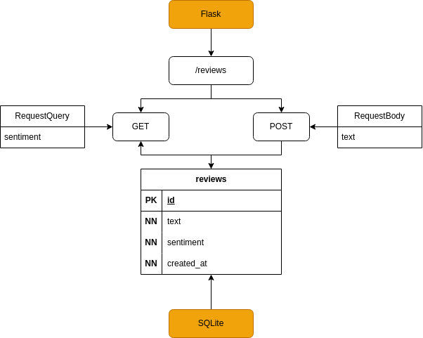

# User Feedback Collector

Мини-сервис, который принимает отзыв и сразу оценивает его настроение

### Скачивание проекта
```bash
git clone \
  --single-branch \
  --depth=1 \
  https://github.com/ames0k0/TT--Flask--User-Feedback-Collector.git
```

### Запуск проекта
```bash
cd TT--Flask--User-Feedback-Collector

# Создания и Активации виртуальной окружении
python -m venv env
source env/bin/activate

# Установка зависимости и Запуск проекта
pip install flask==3.1.1
python app.py
```

### Эндпоинты
- <details>
  <summary><strong>POST /reviews</strong> - Сохранение отзыва</summary>

  | Тело запроса    | Тип   | Описание  | Пример                    |
  | --------------- | ----- | --------- | ------------------------- |
  | *               | JSON  | Отзыв     | { "text": "ваш отзыв" }   |

  ```bash
    curl -X 'POST' \
    -H 'Content-type: application/json' \
    -d '{ "text": "ваш отзыв" }' \
    'http://127.0.0.1:5000/reviews'
  ```

  ```json
  {
    "id":3,
    "text":"Hello, World!",
    "created_at":"2025-07-08T16:06:20.003726+00:00",
    "sentiment":"neutral"
  }
  ```
  </details>
- <details>
  <summary><strong>GET /reviews</strong> - Получение отзывов с фильтрацией</summary>

  | Параметры запроса   | Тип       | Описание              | Пример                |
  | ------------------- | --------- | --------------------- | --------------------- |
  | sentiment           | Строка    | Фильтр по настроение  | sentiment=negative    |

  ```bash
  curl -X 'GET' \
    'http://127.0.0.1:5000/reviews'
  ```

  ```json
  [
    {
      "id": 1,
      "sentiment": "negative",
      "text": "хорошо \nплохо\n\n\nплохо",
      "created_at": "2025-07-08T13:10:49.659703+00:00"
    }
    {
      "id": 2,
      "text": "хорошо",
      "sentiment": "positive",
      "created_at": "2025-07-08T13:10:52.068051+00:00"
    },
    {
      "id":3,
      "text":"ваш отзыв",
      "sentiment":"neutral",
      "created_at":"2025-07-08T16:06:20.003726+00:00"
    }
  ]
  ```

  ```bash
  curl -X 'GET' \
    'http://127.0.0.1:5000/reviews?sentiment=negative'
  ```

  ```json
  [
    {
      "id": 1,
      "text": "хорошо \nплохо\n\n\nплохо",
      "sentiment": "negative",
      "created_at": "2025-07-08T13:10:49.659703+00:00"
    }
  ]
  ```

  </details>

---

<p align="center"></p>